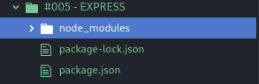

# EXPRESS

Express is fast, unopinionated, minimalist web framework for Node.js
It is one of the most used frameworks on the market, because it makes the programmer more productive when developing the application.
You can install [here](https://expressjs.com/en/starter/installing.html).

## HOW INSTALL EXPRESS

1. Check if `npm` is installed in your machine:

~~~
npm -v
~~~

2. On your working directory run:

~~~
npm init
~~~

> You need add some informations. Fill in just your name, and the name of the project. The rest you can leave blank by hitting Enter.

3. Now install express:

~~~
npm install express --save
~~~

Some folders was add in your workspace:

