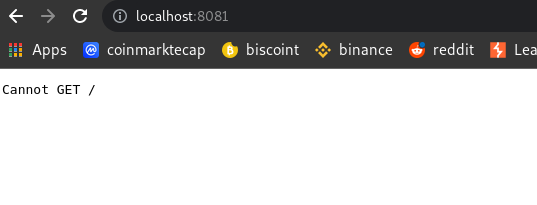

# EXPRESS

Express is fast, unopinionated, minimalist web framework for Node.js
It is one of the most used frameworks on the market, because it makes the programmer more productive when developing the application.
You can install [here](https://expressjs.com/en/starter/installing.html).

## HOW INSTALL EXPRESS

1. Check if `npm` is installed in your machine:

~~~
npm -v
~~~

2. On your working directory run:

~~~
npm init
~~~

> You need add some informations. Fill in just your name, and the name of the project. The rest you can leave blank by hitting Enter.

3. Now install express:

~~~
npm install express --save
~~~

Some folders was add in your workspace:

## HOW USE EXPRESS AND CREATE A HTTP SERVER

It's pretty easy use express in your code.

1. First we need import express with `require()`

~~~javascript
const express = require("express");
~~~

2. Then, we gonna attribute the module in other variable calling the `express()` function:

~~~javascript
const express = require("express");
const app = express();
~~~

> Pay attention, the variable `app` now has everything from express. All modules and functions from express are contained in this variable. So it is good to set it to `const`, just to avoid changing its state

3. Now create a server adding `app.listen(8081)` in your code. I choose 8081 port, but you can change to another:

~~~javascript
const express = require("express");
const app = express();

app.listen(8081, function(){
  console.log("server running on http://localhost:8081");
});
~~~

> I use a callback function just to show a message in terminal

;
