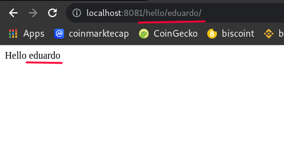
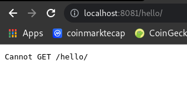

# ROUTES

A route is a "path" that will be "called" by an application or client and respond to some information.

For example, when I access [https://google.com](https://www.google.com/) it returns the default Google page, but when I access [https://google.com/robots.txt](https://www.google.com/robots.txt) it returns other data. Because we accessed another route, in this case robots.txt

;

 

;

Each route can have one or more functions, and it must be unique; when it receives a call it does all the necessary processing to return the data that was requested.

 

And there is no point in randomly accessing any route, it must be a route known by the application. In other words, there is no point in "creating" new non-existent routes because the back-send will return an error, probably with code 404. Like this:

;

## HOW USE ROUTES IN EXPRESS

When you access the webpage in first time, you saw a message like that: `cannot get /` in HTML body. This is why we don't configure any route in our application.

1. Add a route in code:

~~~javascript
app.get("/", function(req, res){
  res.send("Welcome to my website!");
});
~~~

> app.get(route, callback function)

Your code:

~~~javascript
const express = require("express");
const app = express();

app.get("/", function(req, res){
  res.send("Welcome to my website!");
})

app.listen(8081, function(){
  console.log("server running on http://localhost:8081");
});
~~~

If necessary you can add more routes, like:

~~~javascript
const express = require("express");
const app = express();

app.get("/", function(req, res){
  res.send("Welcome to my website!");
})

// Adding more routes
app.get("/about", function(req, res){
  res.send("About us");
})

app.get("/roadmap", function(req, res){
  res.send("Our roadmap");
})

app.listen(8081, function(){
  console.log("server running on http://localhost:8081");
});
~~~

## USING PARAMETERS

We can pass parameters in the URL and manipulate this data with nodejs. This is possible because we have access to the request and response from our HTTP server.

1. In any route, add `/:parameter` for example:

~~~javascript
// With param
app.get("/hello/:name", function(req, res){
  res.send("Hello " + req.params.name)
});
~~~

Then we can add **param** in url:

  ;

> But keep in mind, that when we do this it is mandatory to pass a parameter in the route. Otherwise, an error will occur.

;
