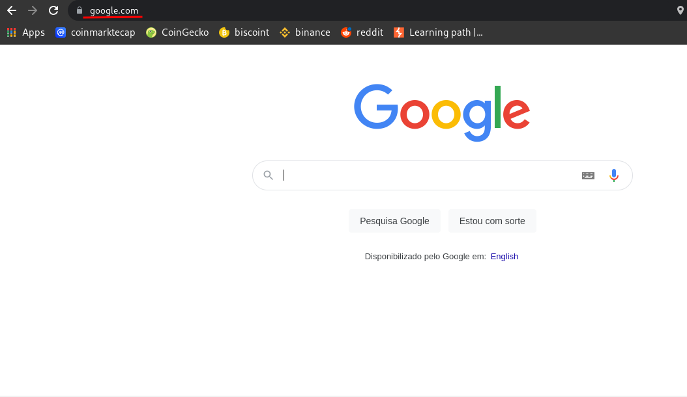

# ROUTES

A route is a "path" that will be "called" by an application or client and respond to some information.

For example, when I access [https://google.com](https://www.google.com/) it returns the default Google page, but when I access [https://google.com/robots.txt](https://www.google.com/robots.txt) it returns other data. Because we accessed another route, in this case robots.txt

;

 

;
